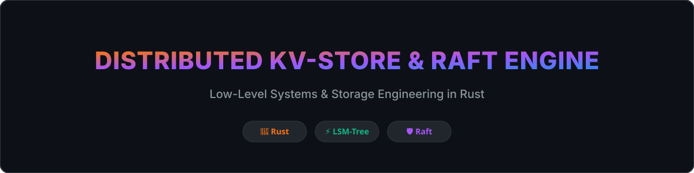
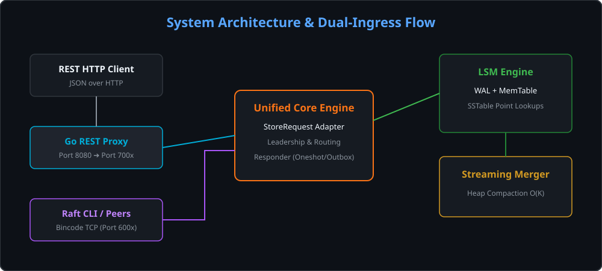
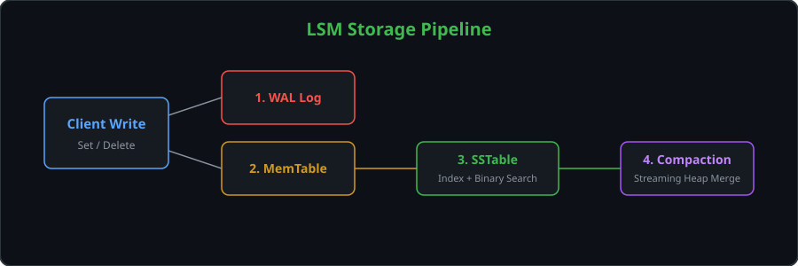
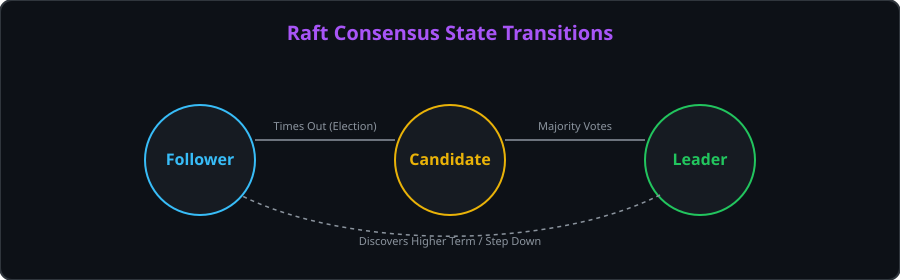
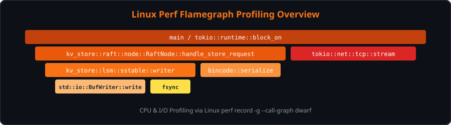
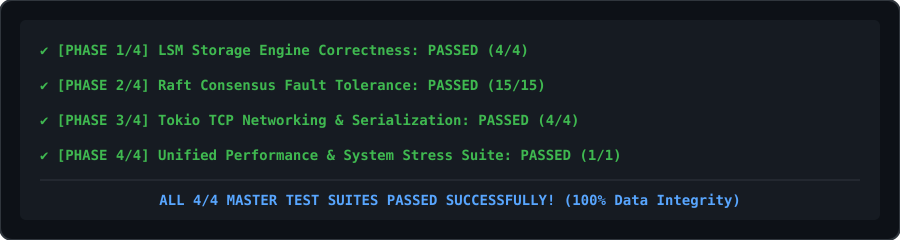

<div align="center">

# Distributed Key-Value Store & Consensus Engine

**A high-performance, fault-tolerant distributed key-value database built from scratch in Rust.**

[](https://www.rust-lang.org/)
[](LICENSE)
[](https://raft.github.io/)
[](https://en.wikipedia.org/wiki/Log-structured_merge-tree)

---



</div>

## Executive Summary

This project is a low-level systems and distributed infrastructure engine implementing a **persistent LSM-tree storage layer** paired with a **custom Raft consensus & replication protocol** built from scratch in Rust over Tokio TCP.

Designed as an engineering showcase in **systems programming**, **concurrent I/O**, **zero-copy streaming**, **consensus safety**, and **profiling-driven optimization**, the database provides both single-node high-throughput key-value operations and strong consistency across multi-node Raft clusters.

---

## Key Engineering Highlights

- **LSM-Tree Storage Engine**: Persistent Write-Ahead Logging (WAL), in-memory skip/hash MemTable, immutable SSTables with sparse index blocks, and a memory-efficient $O(K)$ streaming k-way merge compaction pipeline.
- **Unified Dual-Ingress Core**: A unified execution pipeline handling both external HTTP/REST client API calls (via Go HTTP proxy) and native binary Raft P2P node communication without logic duplication.
- **Raft Consensus Protocol**: Custom Raft implementation featuring Leader Election, Log Replication, Quorum Commit, Log Matching & Conflict Resolution, Follower Catch-up, and Stale Leader Fencing.
- **Fault-Tolerance Verification**: Robust test harness simulating network partitions, packet drops, message reordering, follower restart, and split-brain scenarios.
- **Profiling-Driven Optimization**: Linux `perf` and flamegraph profiling resulting in zero unnecessary allocations, buffered I/O, reused SSTable file descriptors, and streaming compaction.

---

## Benchmark & System Metrics

Recorded on a local Linux benchmark suite running Release mode optimizations (`./run_all_tests.sh`):

| Workload Phase | Throughput (ops/sec) | p50 Latency | p95 Latency | p99 Latency |
| :--- | :--- | :--- | :--- | :--- |
| **Standalone Read (Hit)** | **205,479 ops/s** | 4.25 µs | 6.52 µs | 11.36 µs |
| **Standalone Read (Miss)** | **1,314,177 ops/s** | 634 ns | 990 ns | 1.14 µs |
| **Standalone Insert** | **68,139 ops/s** | 8.67 µs | 14.91 µs | 24.79 µs |
| **1-Node Raft Cluster** | **10,534 ops/s** | 43.42 µs | 430.76 µs | 664.20 µs |
| **3-Node Raft Cluster** | **3,249 ops/s** | 147.34 µs | 1.01 ms | 1.81 ms |
| **5-Node Raft Cluster** | **1,999 ops/s** | 233.93 µs | 1.85 ms | 2.95 ms |

> **Resource Footprint**: ~5.83 MB Process Memory (RSS) | ~100% Data Integrity Verification across all cluster configurations.

---

## System Architecture



### Unified Ingress & Request Pipeline
Both client REST/JSON calls and binary Raft node communications are converted into a normalized `StoreRequest` enum (`Set`, `Get`, `Delete`, `Status`). Responses are decoupled via a `Responder` pattern:
- **`Responder::Oneshot`**: Async channel responder returning JSON `ServiceResponse` to the REST API adapter.
- **`Responder::RaftClient`**: Binary network outbox responder returning `ClientResponse` to Raft peers/CLI clients.

---

## Technical Implementation

### 1. Storage Engine (LSM-Tree)
- **WAL & Crash Recovery**: Synchronous sequential append log recording every state mutation before MemTable insertion. Replayed automatically on node restart.
- **MemTable & SSTable Flush**: In-memory write buffer flushed to SSTables with binary search index blocks for $O(\log N)$ point lookups.
- **Streaming K-Way Merge Compaction**: Replaced memory-heavy $O(N)$ hash-table merges with a heap-based $O(K)$ streaming merge, processing sorted SSTable iterators directly to disk without loading full datasets into RAM.



### 2. Raft Consensus Engine
- **Asynchronous Tokio TCP Transport**: Custom binary length-prefixed protocol using Bincode serialization for P2P consensus RPCs (`RequestVote`, `AppendEntries`).
- **Log Replication & Quorum Commit**: Leader-driven log entry replication requiring majority ACK before committing to state machine.
- **Linearizable Read & Forwarding**: Unified leadership checks ensure write requests are handled by the cluster leader, with automatic follower redirect or auto-forwarding.



---

## Performance & Profiling

Linux `perf` and flamegraph profiling were used to eliminate bottleneck syscalls and memory allocations:



- **Zero-Allocation Readers**: Reused file descriptors and pre-allocated binary buffers during SSTable reads and WAL recovery.
- **Buffered I/O**: `BufReader` / `BufWriter` wrapping disk streams to minimize kernel context switches during sequential writes.
- **Streaming Heap Merger**: Eliminates memory allocation spikes during multi-level compaction.

---

## Testing & Verification

Includes a comprehensive, automated 4-phase test suite (`./run_all_tests.sh`):



```bash
# Run the complete test suite
./run_all_tests.sh
```

- **Phase 1 (Storage Correctness)**: CRUD operations, WAL recovery, flush & compaction, concurrent reads/writes.
- **Phase 2 (Raft Fault Tolerance)**: Elections, network partitions, split-brain isolation, message drops & reordering.
- **Phase 3 (TCP Networking)**: Tokio async connection management, wire serialization.
- **Phase 4 (Unified System Stress & Benchmarks)**: End-to-end data integrity checks across 1, 3, and 5-node active clusters.

---

## Getting Started

### Prerequisites
- **Rust Toolchain**: `rustc` / `cargo` (1.75+)
- **Linux Environment** (recommended for `perf` and full bash test suite)
- **Go** (optional, for REST API gateway proxy)

### Quick Start

```bash
# Clone the repository
git clone https://github.com/KrishnaAdityaSrivastava/Rust-Database.git
cd Rust-Database

# Build release binary
cargo build --release

# Run master test & benchmark suite
./run_all_tests.sh
```

### Running a Multi-Node Raft Cluster

```bash
# Terminal 1 (Node 1)
cargo run --bin node -- --id 1 --addr 127.0.0.1:6001 --api-addr 127.0.0.1:7001 --peers 2:127.0.0.1:6002,3:127.0.0.1:6003

# Terminal 2 (Node 2)
cargo run --bin node -- --id 2 --addr 127.0.0.1:6002 --api-addr 127.0.0.1:7002 --peers 1:127.0.0.1:6001,3:127.0.0.1:6003

# Terminal 3 (Node 3)
cargo run --bin node -- --id 3 --addr 127.0.0.1:6003 --api-addr 127.0.0.1:7003 --peers 1:127.0.0.1:6001,2:127.0.0.1:6002
```

### Interactive CLI Client

```bash
cargo run --bin client -- 127.0.0.1:6001
```

---

## Project Structure

```text
.
├── api/                   # Go REST HTTP Proxy Gateway
│   └── main.go
├── docs/                  # Architecture & benchmark image assets
│   └── images/
├── src/
│   ├── database/          # High-level Database handle, recovery & compaction
│   ├── lsm/               # Storage layer (MemTable, SSTable, WAL, format)
│   ├── raft/              # Consensus engine (Node, Replication, Request, Message)
│   └── runtime/           # Tokio Async Runtime, TCP Network listener & Simulator
├── tests/                 # Integration & fault tolerance test suites
│   ├── correctness.rs
│   ├── raft_fault_tolerance.rs
│   ├── raft_network.rs
│   └── unified_suite.rs
└── run_all_tests.sh       # Master test automation script
```

---

## License

Distributed under the [MIT License](LICENSE).
